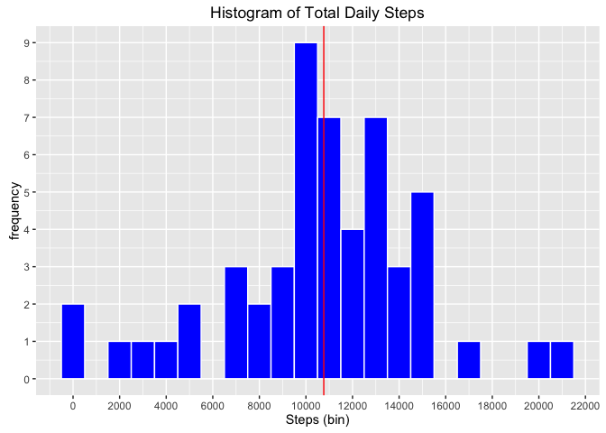
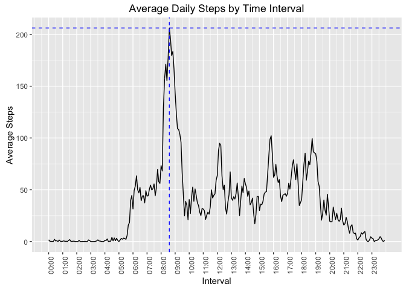
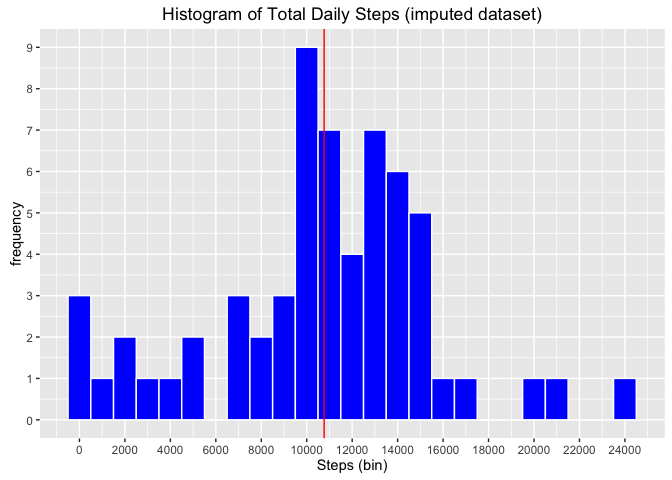
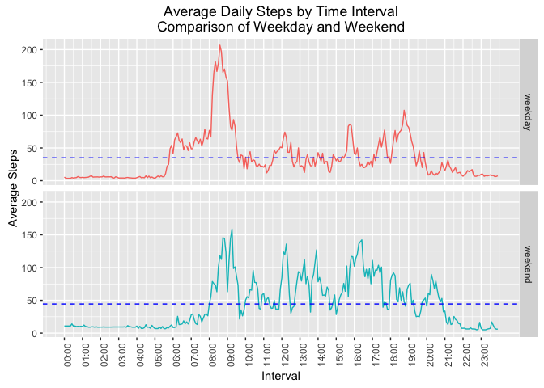

# Reproducible Research: Peer Assessment 1


## General

### Libraries

This analysis uses the R packages `dplyr`, `ggplot2` and `lubridate`

```r
library(dplyr)
library(ggplot2)
library(lubridate)
```
  
The assignment instructions state: *"For the plotting aspects of this assignment, feel free to use any plotting system in R (i.e., base, lattice, ggplot2)"*. For this report, the **ggplot2** plotting system is used.
  
--- 

## Loading and preprocessing the data

Activity data is downloaded from the [data repository](d396qusza40orc.cloudfront.net/repdata%2Fdata%2Factivity.zip) to a temporary
file, and then loaded to the variable `activity` using `read.csv`.


```r
temp <- tempfile()
zp <- "https://d396qusza40orc.cloudfront.net/repdata%2Fdata%2Factivity.zip"
download.file(zp,temp)
activity <- read.csv(unz(temp,"activity.csv"))
unlink(temp)
```

Information about the *raw* data file:

```r
str(activity)
```

```
## 'data.frame':	17568 obs. of  3 variables:
##  $ steps   : int  NA NA NA NA NA NA NA NA NA NA ...
##  $ date    : Factor w/ 61 levels "2012-10-01","2012-10-02",..: 1 1 1 1 1 1 1 1 1 1 ...
##  $ interval: int  0 5 10 15 20 25 30 35 40 45 ...
```

The variables included in this dataset are:

* **steps**: Number of steps taking in a 5-minute interval (missing values are coded as 𝙽𝙰)
* **date**: The date on which the measurement was taken in YYYY-MM-DD format
* **interval**: Identifier for the 5-minute interval in which measurement was taken

---

#### Cleaning Data - Date and Interval  
The variable `date` is imported as a `factor`.  This is changed to a date format.  
The raw data indicates that the `interval` is class: integer. 
Inspection shows that the number actually corresponds to a time in the format "HHMM", e.g. 830 is 8:30, 2315 is 23:15.  
For the purposes of analysis, a `datetime` variable is created.  Dividing the time by 100 gives a number of the type `5.35`, this is passed as a string to the `lubridate` function
'ymd_hm' which parses the date string to product a POSIXct.date. 
(Difficulties associated with the time period spanning the Australian daylight savings are avoided using this method)


```r
activity$date <- as.Date(activity$date)
activity$datetime <- ymd_hm(paste(activity$date,
                                format(activity$interval/100,digits=4),sep=" "))
str(activity$datetime)
```

```
##  POSIXct[1:17568], format: "2012-10-01 00:00:00" "2012-10-01 00:05:00" ...
```

---

#### Cleaning Data - NAs

There is missing data in the data set:

```r
activity.rows <- nrow(activity)
activity.rowsNA <- nrow(activity[!is.na(activity$steps),])
nas <- format((1 - activity.rowsNA/activity.rows)*100,digits=4)
```
  -  Of the 17568 observations, the number of "complete cases" is 15264.  
  -  13.11% observations are incomplete.

----

#### Format of cleaned data
Cleaned data set (inlcuding NA's)

```r
str(activity)
```

```
## 'data.frame':	17568 obs. of  4 variables:
##  $ steps   : int  NA NA NA NA NA NA NA NA NA NA ...
##  $ date    : Date, format: "2012-10-01" "2012-10-01" ...
##  $ interval: int  0 5 10 15 20 25 30 35 40 45 ...
##  $ datetime: POSIXct, format: "2012-10-01 00:00:00" "2012-10-01 00:05:00" ...
```


---

## What is the mean total number of steps taken per day?

To calculated the mean of the total number of steps taken each day, the daily
totals are calculated. 

```r
step.totalDay <- activity%>%
        filter(!is.na(steps))%>%
        group_by(date)%>%
        summarise(total=sum(steps))
summary(step.totalDay)
```

```
##       date                total      
##  Min.   :2012-10-02   Min.   :   41  
##  1st Qu.:2012-10-16   1st Qu.: 8841  
##  Median :2012-10-29   Median :10765  
##  Mean   :2012-10-30   Mean   :10766  
##  3rd Qu.:2012-11-16   3rd Qu.:13294  
##  Max.   :2012-11-29   Max.   :21194
```

```r
step.median <- median(step.totalDay$total, na.rm=TRUE)
step.mean <- mean(step.totalDay$total, na.rm=TRUE)
```
 
  
  - The **median** of the total number of steps per day is: 10765  
  - The **mean** of the total number of steps per day is: 10766.19 
  
###Histogram of daily total steps
  
A histogram can be used to show the frequency of total steps-per-day for the sampling period.  A bin size of 1000 steps is used.  

The red line indicates the mean value (10766.19 )
  

```r
g <- qplot(step.totalDay$total, geom="histogram", 
           binwidth=1000, fill=I("blue"),col=I("white"))
g <- g +  labs(title="Histogram of Total Daily Steps", x = "Steps (bin)", y = "frequency")
g <- g + scale_y_continuous(breaks=c(0:10)) + scale_x_continuous(breaks=seq(0,25000,by=2000))
g <- g + geom_vline(xintercept = mean(step.totalDay$total), colour=I("red"))
g
```


  
  


----

## What is the average daily activity pattern?  

To produce a time series plot of the average daily activity, the average number of steps
is averaged across all dates, and then plotted against the 5-minute interval.  
  
Calculation of average steps by time interval, and maximum average:

```r
step.avg <- activity %>% filter(!is.na(steps))%>%
        group_by(time=hour(datetime)+minute(datetime)/60,
                 label=format(datetime,"%H:%M"), interval) %>% 
                         summarise(avg=mean(steps))
max_steps <- max(step.avg$avg)
time_max <- step.avg$time[step.avg$avg==max_steps]
```


Time Series Plot (using ggplot2):

```r
g <- qplot(x=time, y=avg ,data = step.avg, geom="line")
g <- g + geom_hline(yintercept = max_steps, colour=I("blue"), linetype="dashed")
g <- g + geom_vline(xintercept = step.avg$time[step.avg$time==time_max],
                    colour=I("blue"),linetype="dashed") 
g <- g + scale_x_continuous(breaks=seq(0,23,1),
                            labels=unique(step.avg$label)[seq(1,24*12,12)])
g <- g + theme(axis.text.x = element_text(angle = 90, hjust = 1))
g <- g + labs(title="Average Daily Steps by Time Interval", 
              x = "Interval", 
              y = "Average Steps")
g 
```


  

  
  
  -  The **maximum** average steps in any interval is: 206.1698
  
  -  The maximum average interval corresponds to the **time**: 08:35


--- 
  
## Imputing missing values
As previously stated, the raw date set contains 17568 observations, of  which the number of "complete cases" is 15264.  
13.11% observations are incomplete (i.e. contain NAs)

**The total number of missing values in the data set is 2304.**

#### Imputate the original data for missing values, using the average daily steps
Method of imputation: replace NAs with the average daily step count associated with the interval. This is achieved by merging the average daily step counts with the original activity data. A new variable `stepsI` contains the exisitng and imputed value for step counts.


```r
merged <- merge(activity,step.avg,by.x="interval", by.y="interval")
activity$stepsI <- activity$steps
activity$stepsI[is.na(activity$stepsI)] <- merged$avg[is.na(merged$steps)]
```


  
###Histogram of daily total steps with imputed values

Recalculate the daily totals, median and mean.


```r
step.totalDayI <- activity %>% group_by(date) %>% summarise(totalI=sum(stepsI))
summary(step.totalDayI)
```

```
##       date                totalI     
##  Min.   :2012-10-01   Min.   :   41  
##  1st Qu.:2012-10-16   1st Qu.: 8821  
##  Median :2012-10-31   Median :11015  
##  Mean   :2012-10-31   Mean   :10766  
##  3rd Qu.:2012-11-15   3rd Qu.:13646  
##  Max.   :2012-11-30   Max.   :24444
```

```r
step.medianI <- median(step.totalDayI$totalI)
step.meanI <- mean(step.totalDayI$totalI)
```


```r
g <- qplot(step.totalDayI$totalI, geom="histogram", 
      binwidth=1000, fill=I("blue"),col=I("white"))
g <- g +  labs(title="Histogram of Total Daily Steps (imputed dataset)", x = "Steps (bin)", y = "frequency")
g <- g + scale_y_continuous(breaks=c(0:10)) + scale_x_continuous(breaks=seq(0,25000,by=2000))
g <- g + geom_vline(xintercept = mean(step.totalDayI$totalI), colour=I("red"))
g
```



For the imputed data set:  

  -  The **median** of the total number of steps per day is: 11015  
This is an increase when compared with 10765 for the raw data set. 

  -  The **mean** of the total number of steps per day is: 10766.19  
This has had no effect when compared to the raw data set (10766.19)  due to the method of imputation, where daily averages were applied.

----

## Are there differences in activity patterns between weekdays and weekends?
Create a factor `dayType` in the data set for weekday or weekend based on the date.

```r
activity$dayType <- factor(weekdays(as.Date(activity$date))
                            %in%c("Saturday","Sunday")
                         ,labels=c("weekday","weekend"))
```

Create a dataset that averages the total steps for each interval and type (weekday / weekend).  
The mean and total of the average daily steps is also calculated, to assist in the comparison in activity patterns.  


```r
step.avgType <- activity %>%
        group_by(time=hour(datetime)+minute(datetime)/60,
                 label=format(datetime,"%H:%M"), type=dayType) %>% 
                         summarise(avg=mean(stepsI))
summary_type <- data.frame(type=levels(activity$dayType),
                meanSteps=sapply(split(step.avgType$avg,step.avgType$type),mean),
                totalSteps= sapply(split(step.avgType$avg,step.avgType$type),sum))
summary_type[,2:3]
```

```
##         meanSteps totalSteps
## weekday  34.88631   10047.26
## weekend  44.40342   12788.18
```


The activity patterns is shown a panel plot containing a time series plot of the 5-minute interval (x-axis) and the average number of steps taken.
Time Series Plot (using ggplot2):

```r
g <- qplot(x=time, y=avg, data = step.avgType, geom="line", color=type)
g <- g + facet_grid(type~.)
g <- g + scale_x_continuous(breaks=seq(0,23,1),
                            labels=unique(step.avg$label)[seq(1,24*12,12)])
g <- g + theme(axis.text.x = element_text(angle = 90, hjust = 1), legend.position="none")
g <- g + labs(title="Average Daily Steps by Time Interval\nComparison of Weekday and Weekend", 
              x = "Interval", 
              y = "Average Steps")

g <- g + geom_hline(aes(yintercept = meanSteps), summary_type,colour=I("blue"), linetype="dashed")
g 
```


  
  
**Differences in Activity Patterns for Weekdays vs Weekends**

Comparison of weekend and weekday data shows that on **weekends**:  

  -  Average daily steps is **higher**
  -  Activity begins **later** in the day
  -  Activity is more **evenly distributed** across this period.

